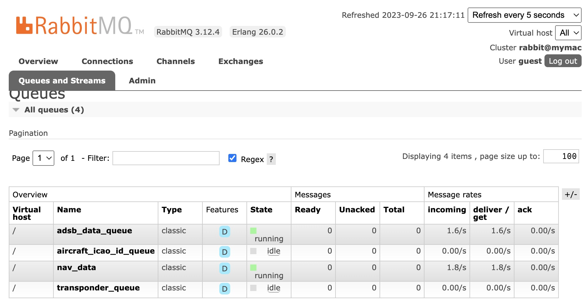
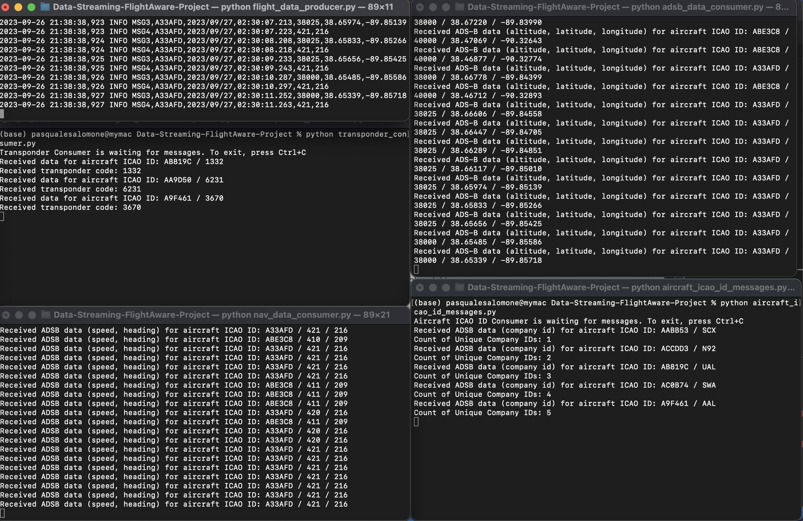
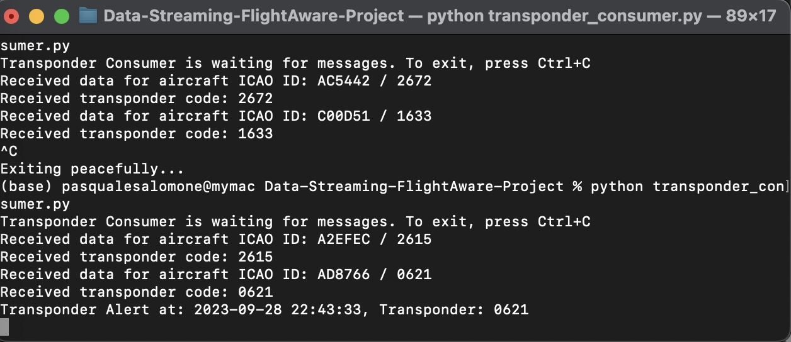

# Data Streaming FlightAware Project
Author: Pasquale Salomone
 
Date: September 26, 2023

## Overview

The Module7-FlightAwareProject is a streaming analytics project designed to process and analyze flight data in real-time. This project aims to provide insights into flight-related information and demonstrate the use of message brokers and consumers to handle streaming data. In specific, it also explores the concept of heartbeat message (message is sent periodically by the producer to the broker to indicate that it is still alive and functioning properly. This allows the broker to detect if the producer has failed and to take appropriate action, such as requeuing the messages that were being produced by the failed producer) and the concept of buffering (the process of temporarily storing messages in memory before they are sent to the broker).Data generated in this project will then be explored in another Gitrepo using Python. 

## Data Sources

The project utilizes live data from FlightAware, a leading provider of aviation data and flight tracking information, through PiAware 7.2 running on a Raspberry PI. The original data sources include various flight-related information such as aircraft identifiers, timestamps, altitude, latitude, longitude, speed, heading, and transponder codes.

## Resources

- [FlightAware](https://www.flightaware.com/)
- [Automatic Dependent Surveillance - Broadcast (ADS-B)](https://www.faa.gov/about/office_org/headquarters_offices/avs/offices/afx/afs/afs400/afs410/ads-b)
- [PiAware](https://blog.flightaware.com/piaware-7-release#:~:text=PiAware%207%20has%20several%20new,(SD%20Card%20Image%20only).)
- [Transponder Codes](https://code7700.com/transponder.htm)

### Producers

1. **flight_data_producer.py**: This producer script fetches live flight data from PiAware running on a Raspberry PI and publishes it to RabbitMQ message brokers. It creates a continuous generation of flight data for real-time processing.

### Consumers

1. **adsb_data_consumer.py**: This consumer script listens to the "adsb_data_queue" and processes Automatic Dependent Surveillance–Broadcast (ADS-B) data, including fields like type_msg aircraft_icao_id,first_date,first_timestamp,altitude,latitude,longitude. It stores this data in a CSV file.
2. **nav_data_consumer.py**: This consumer script listens to the "nav_data_queue" and processes navigation-related data, including type_msg,aircraft_icao_id,first_date,first_timestamp,speed,heading It also stores this data in a CSV file.
3. **aircraft_icao_id_consumer.py**: This consumer script listens to the "aircraft_icao_id_queue" and processes aircraft ICAO ID data, including type_msg,aircraft_icao_id,first_date,first_timestamp,company_id. It also displays the count of unique ICAO Code (company_id), and it only stores unique messages data in a CSV file.
4. **transponder_consumer.py**: This consumer script listens to the "transponder_queue" and processes transponder data, including type_msg,aircraft_icao_id,first_date,first_timestamp,transponder. If certain type of transponder codes are received (7600,7700,7500) it displays an alert on screen and sends an email to the end user. It only stores unique transponder data in a CSV file to avoid logging in the same transponder code and aircraft id multiple times.

## Output

The output of this streaming analytics project includes several CSV files, each containing specific flight-related information:

- **adsb_data_messages.csv**

- **nav_data_messages.csv**

- **aircraft_icao_id_messages.csv**

- **transponder_messages.csv**

## Screenshots

Screenshots of RabbitMQ queues, execution of consumer scripts in separate terminals, and sample data are included in this repository to illustrate the project's functionality.

## Video
<video width="width_value" height="height_value" controls>
    <source src="https://drive.google.com/file/d/1_M6whdH8SREa0mt-FrY7T9Fh9E9ATcyw/view?usp=drive_link" type="video/mp4">
    Your browser does not support the video tag.
</video>

## Acknowledgments

I would like to acknowledge Stackoverflow, ChatGPT, Google Bard as an instrumental aid in the development of this project.

## License

This project is licensed under the MIT License.

